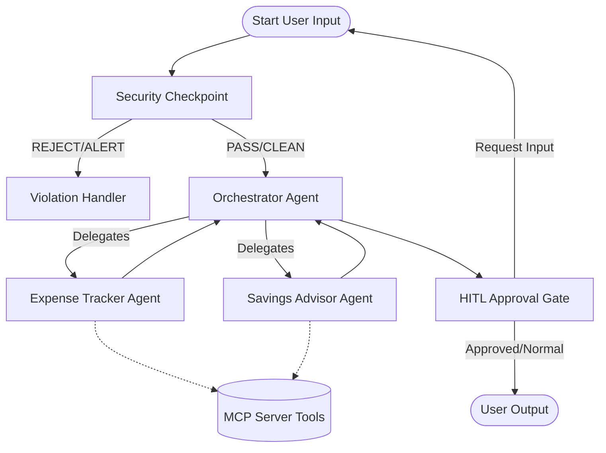

# Submission Write-Up: FinanceFriend Concierge Agent

This document details the architecture, design choices, security guardrails, and implementation details of **FinanceFriend**, a production-grade personal finance concierge agent built using ADK 2.0 and the Model Context Protocol (MCP).

---

## 1. Executive Summary & Capabilities
**FinanceFriend** is a multi-agent personal finance concierge designed to securely and autonomously assist users with expense logging, transaction histories, savings goals, and budget advisory. 

### Key Capabilities:
- **Balance & Transaction Audits**: Retrieve balances and transactions across accounts using standard MCP tool interfaces.
- **Automated Expense Tracking**: Parse natural language user queries (e.g., *"Log $15 for lunch under food"*) to add categorized transaction records.
- **Budgetary Advisory**: Access savings goals and update savings goal targets dynamically.
- **High-Fidelity Guardrails**: A robust Security Checkpoint that screens user prompts for prompt injections, redacts PII (credit cards, IBANs, bank accounts), and enforces strict domain policies.
- **Human-in-the-Loop (HITL)**: Approval gates for operations involving data state changes (logging expenses, setting savings targets).

---

## 2. Multi-Agent System Architecture

FinanceFriend utilizes a directed graph workflow implemented via the ADK 2.0 API. 



### Flow Walkthrough:
1. **Security Checkpoint**: The entry point. Inspects incoming user content.
2. **Orchestrator**: Routing node. Maps queries to specialized sub-agents via `AgentTool`.
3. **Sub-Agents**:
   - `expense_tracker`: Logs expenses and reviews transaction history. Connects directly to the local MCP server.
   - `savings_advisor`: Recommends saving plans and updates goals. Connects to the local MCP server.
4. **Human-in-the-Loop (HITL) Gate**: Inspects proposed state-changing actions (e.g. logging an expense, modifying savings goals) and prompts the user for confirmation via `RequestInput`.

---

## 3. Security Checkpoint Design & Policy Rules

To enforce corporate security standards, the entry function node `security_checkpoint` runs four parallel audits:

1. **PII Scrubbing**: Regex filters automatically scrub Credit Cards and International Bank Account Numbers (IBANs/Account Numbers), replacing them with `[REDACTED CARD]` and `[REDACTED ACCOUNT]`.
2. **Prompt Injection Detection**: Blocks queries containing override instructions (e.g., *"ignore previous instructions"*, *"override config"*).
3. **Threshold Enforcement**: A strict domain policy blocks any transaction query attempting to log or request an amount greater than **$10,000**.
4. **JSON Audit Logging**: Generates compliance audit logs in JSON format outputted to stdout for security monitoring:
   ```json
   {
     "session_id": "32e17c60-5a92-4e6e-90a6-dd651889d74d",
     "timestamp": "1782292027291",
     "severity": "WARNING",
     "pii_scrubbed": false,
     "injection_detected": false,
     "large_transaction_blocked": true
   }
   ```

---

## 4. MCP Server & Tool Specifications

The application launches a standalone MCP Server on port `8090` using stdio communication. It exposes five relational data-access tools:

| Tool Name | Parameters | Return Type | Description |
|-----------|------------|-------------|-------------|
| `get_balance` | `account: str` | `str` | Returns the current balance for Checking, Savings, or Credit Card. |
| `get_transactions` | None | `str` | Returns list of recent transaction history records. |
| `add_transaction` | `amount: float`, `category: str`, `description: str` | `str` | Appends a new transaction to the ledger. |
| `get_savings_goals` | None | `str` | Retrieves current saving goals and progress. |
| `update_savings_goal` | `goal_name: str`, `target: float` | `str` | Updates the target amount for a named savings goal. |

---

## 5. Human-in-the-Loop (HITL) Verification Flow

Any transaction update requires explicit human consent:
1. If the Orchestrator proposes to **log an expense** or **modify a savings goal**, the `hitl_approval_gate` triggers.
2. The workflow pauses and yields a `RequestInput(interrupt_id="confirm_action")`, displaying a prompt: *"✋ Action Required: Please confirm to apply this change (yes/no):"*.
3. The user's input (`yes` / `no`) is processed.
4. If approved, the agent executes the action and returns confirmation. If rejected, it aborts and notifies the user.

---

## 6. Architecture Diagrams & Visual Assets

### Cover Page Banner


### Multi-Agent Workflows & Tool Interactions


